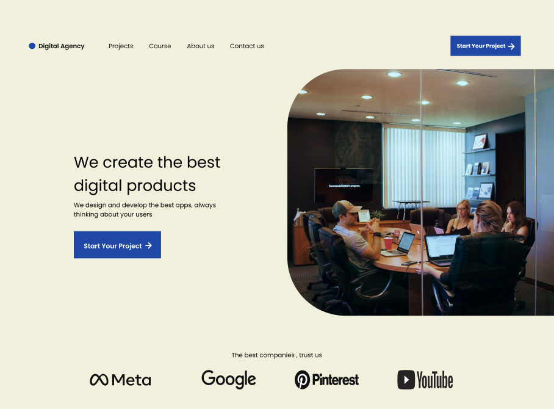
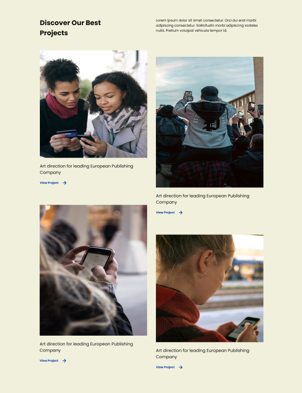
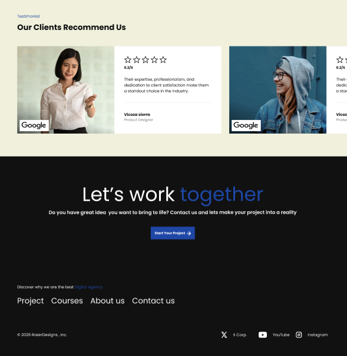

# Digital Agency Website - Figma Design

A modern, responsive web design concept for a **digital agency** / creative studio, built entirely in Figma.

Showcasing clean typography, smooth animations (conceptual), dark/light mode potential, interactive elements, and a strong focus on services, portfolio, and client trust.

## 🎨 Preview

<!-- You can later add live Figma embed or screenshots here -->

<!-- Option 1: Figma prototype link -->
**Live Prototype:** [Open in Figma →](https://www.figma.com/proto/8u3LRCtSQVw1y1XtwBX74u/Project-1?node-id=7-9&p=f&t=nlu9rfZxkZf8ZgE1-1&scaling=min-zoom&content-scaling=fixed&page-id=0%3A1&starting-point-node-id=7%3A9)  

<!-- Option 2: Or embed screenshots (highly recommended) -->
  
  

(Upload 3–6 high-quality screenshots to a `/screenshots` folder and link them like above)

## ✨ Key Features

- Modern & minimal aesthetic
- Fully responsive layouts (mobile → desktop)
- Component-based structure (buttons, cards, nav, hero, testimonials…)
- Dark / Light mode ready (variables used)
- Micro-interactions & hover states conceptualized
- Sections: Hero, Services, Portfolio, About, Testimonials, Contact, Footer

## 🛠️ Tech (Design Tools)

- **Figma** (100% of the design)
- Auto Layout, Variants, Components & Variables heavily used
- Responsive design with breakpoints

## 📁 Project Structure (inside Figma)

- 🎨 **Cover & Documentation** page
- 🏠 **Desktop** artboards
- 📱 **Mobile** variants
- ⚙️ **Components** library
- 🎭 **Styles & Variables**

## 🚀 How to Use

1. Duplicate the Figma file to your account
2. Explore / remix the components
3. Use it as inspiration for your next digital agency / startup / creative studio project
4. Feel free to fork this repo and add your own version!

## 📄 License

MIT License – free to use for personal & commercial projects (just don't sell the file as-is).

Made with ❤️ by Abhijeetkumar

---

⭐ If you like the design → give this repo a star!  
🐛 Found an issue or want to improve something? → open an issue or PR.
